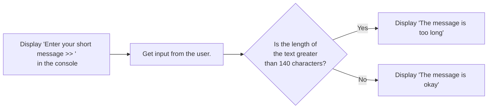

# BIS 305 Assignment 4 - Program Exercise 4-2.

This repo is for use to code and debug the BIS 305 Assignment 4 - Program Exercise 4-2.

### Use Case 1

The inputs in the console could be like:
```html
Enter your short message >> Once more unto the breach, dear friends, once more
```

The output from the console should be:
```html
The message is okay
```

### Use Case 2

The inputs in the console could be like:
```html
Enter your short message >> Once more unto the breach, dear friends, once more; Or close the wall up with our English dead. In peace there's nothing so becomes a man As modest stillness and humility: But when the blast of war blows in our ears, Then imitate the action of the tiger;
```

The output from the console should be:
```html
The message is too long
```

### Here is a flowchart for the logic:  

